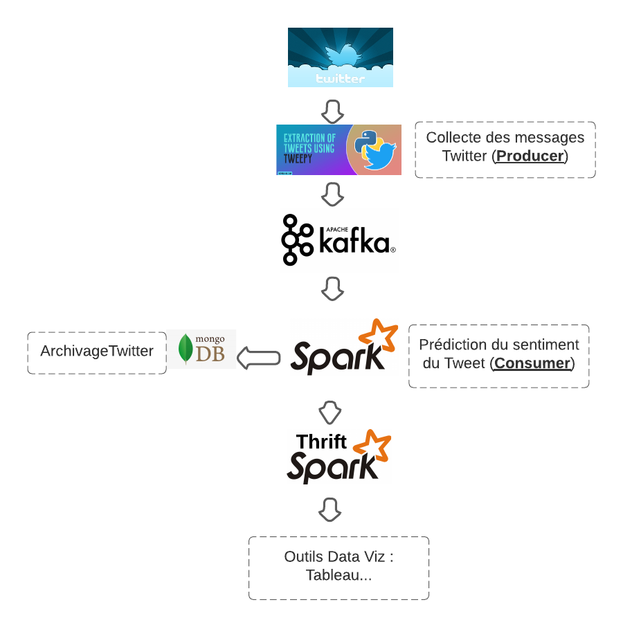

# Contexte

Ce projet a pour but la mise en place d'un pipeline big data, permettant de collecter en temps réel les commentaires publiés sur un réseau social en l’occurrence Twitter puis d’extraire le sentiment exprimé 
par ces commentaires via l’utilisation d’une IA qui a été mise en place à cet effet basée sur des Réseaux de Neurones et NLP. Les données seront ensuite mises à disposition pour 
l’analyse exploratoire en temps réel via des outils de data visualisation.

Le projet se divise en deux parties :

- Première partie de Deep Learning permettant d'entrainer des modèles à base de réseaux de neurone (NLP) pour l'analyse de sentiment [Kaggle](https://www.kaggle.com/hbaflast/french-twitter-sentiment-analysis).
- Deuxième partie de Big Data / Data Visualisation, cette seconde partie à pour but la mise en place d'un pipeline data utilisant : Kafka, Spark Streaming, Hive, MongoDB. Le but de collecter et d'évaluer en temps réel les sentiments exprimés par 
sur les messages twitter, en utilisant le modèle de la première partie. 

